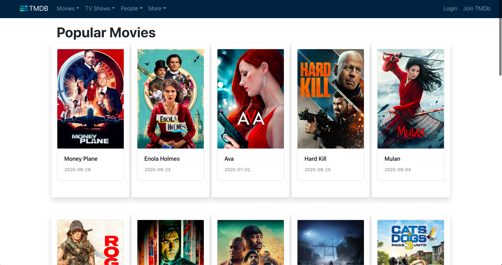

# The-Movie-DataBase 📺 📺
Building a movies and tv series streaming website.
# Motivation 
Everyone loves watching movies and new TV series ❤️ ❤️
# Build status

# Code Style
- Server side code **standard**
- Client side code **PascalCase** 

# Screenshots

# Tech/framework used

- [Node](https://nodejs.org/en/)
- [Express](https://expressjs.com/)
- [Mongo Db](https://www.mongodb.com/)
- [React](https://reactjs.org/)
- [React Router DOM](https://reactrouter.com/web/guides/quick-start)
- [Heroku](https://www.heroku.com)
- [Bootstrap](https://getbootstrap.com/)

# Features
- Reacent Movies/TV series 
- Trending Movies/ TV series
- Popular Movies/TV series
- People
- Personal Profile 
- Playlist 
- Search
- Discussions
- Reviews

# API Reference
-themoviedatabase

# Credits
Netflix , The Movie Database
# License
MIT © Dherendra Dev
